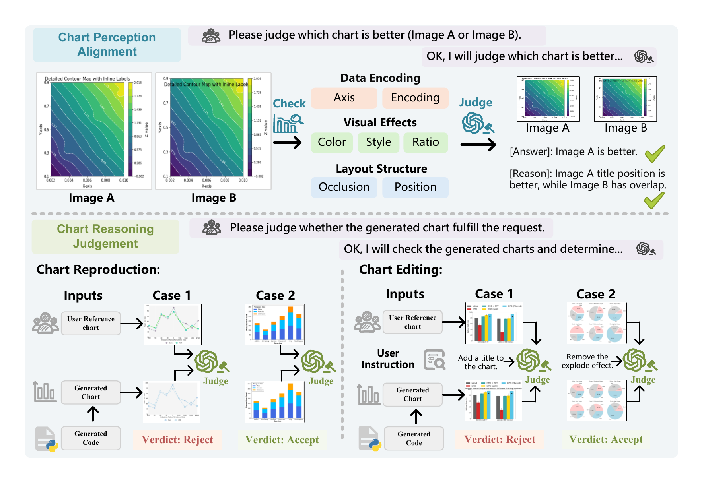

<h2 align="center">ChartJudgeBench: Evaluating LMM Judges for Chart-to-Code Generation</h2>

<h4 align="center">Welcome to ChartJudgeBench! If you find this repository useful, please give it a star ⭐.</h4>

<p align="center">
  
  <a href="https://hush699.github.io/chartjudge/"></a>
  <a href="https://github.com/hush699/ChartJudgeBench"></a>
  <a href="https://huggingface.co/CSU-JPG"></a>
</p>

## 🌟 Overview

**ChartJudgeBench** is a diagnostic benchmark for evaluating LMMs as judges in
chart-to-code workflows. It contains 1,003 Chart Perception Alignment (CPA)
pairwise comparisons and 650 Chart Reasoning Judgment (CRJ) cases covering
Chart Reproduction and Chart Editing. The benchmark centers on one question:
**Can current LMMs evaluate chart-to-code outputs accurately, consistently, and
strictly?** Experiments across 26 state-of-the-art models reveal four systematic
limitations: positional bias, Accept overprediction, difficulty judging visual
style and aesthetics, and unexpected leniency in RL-trained models. These
findings highlight the need to validate LMM judge reliability before using them
as critics or reward models for chart-to-code optimization.

<p align="center">
  
</p>

## 🚀 Quick Start

### 📦 Installation

```bash
git clone https://github.com/hush699/ChartJudgeBench.git
cd ChartJudgeBench
pip install -e .
```

Install only the backend you need:

```bash
pip install -e ".[api]"   # OpenAI-compatible APIs
pip install -e ".[qwen]" # Qwen-style local models
```

For other local models, first create the environment recommended by the model
author, then run `pip install -e . --no-deps`. Backend notes are available in
[configs/models/README.md](configs/models/README.md).

### 🤖 Run Evaluation

The benchmark provides the prompts, image order, output parsing, and scoring.
The three official prompts are stored in `paper_v1` and verified by hash.

#### API Model

Set credentials through environment variables or a local `.env` file:

```text
OPENAI_API_KEY=your_api_key
OPENAI_API_URL=https://your-openai-compatible-endpoint/v1
```

```bash
chartjudge run \
  --task ChartReproduction \
  --config configs/models/openai_compatible.example.json \
  --model-name YOUR_MODEL_NAME \
  --output outputs/predictions.jsonl
```

API keys must never be written into source code or committed to the repository.

#### Local Model

Choose a bundled model configuration and provide your own checkpoint path:

```bash
chartjudge run \
  --task ChartEditing \
  --config configs/models/local/qwen3_vl_32b.json \
  --model-path YOUR_LOCAL_MODEL_PATH \
  --output outputs/predictions.jsonl
```

The bundled configurations contain no private server paths or model weights.
See [the model list](configs/models/README.md) for all supported local backends.

### 📊 Score Predictions

```bash
chartjudge score \
  --task ChartEditing \
  --predictions outputs/predictions.jsonl \
  --output outputs/metrics.json
```

All tasks use Overall Accuracy as the primary metric. Missing predictions and
parse failures count as incorrect.

## 🧩 Use Your Own Model

Models using an OpenAI-compatible endpoint only need the API configuration
above. For another SDK or runtime, implement:

```python
response = adapter.generate(request)
```

See [docs/CUSTOM_MODELS.md](docs/CUSTOM_MODELS.md) and
[examples/custom_model.py](examples/custom_model.py).

## 🎓 Citation

```bibtex
@misc{wu2026chartjudgebench,
  title     = {ChartJudgeBench: Evaluating LMM Judges for Chart-to-Code Generation},
  author    = {Lijian Wu and Henry Henyuan Zhao and Zijian Zhang and Jiahao Tang and Jiajun Wu and Alex Jinpeng Wang},
  note      = {Manuscript},
  year      = {2026}
}
```

## 📄 License

- Code: [Apache License 2.0](LICENSE)
- Dataset: [CC BY 4.0](docs/DATA_LICENSE.md)
